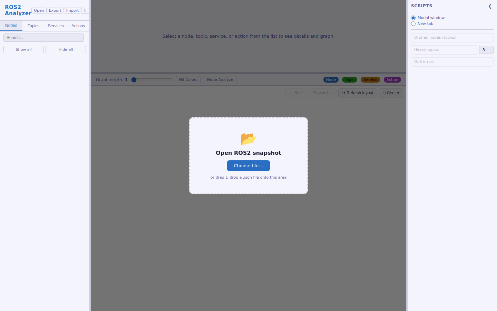
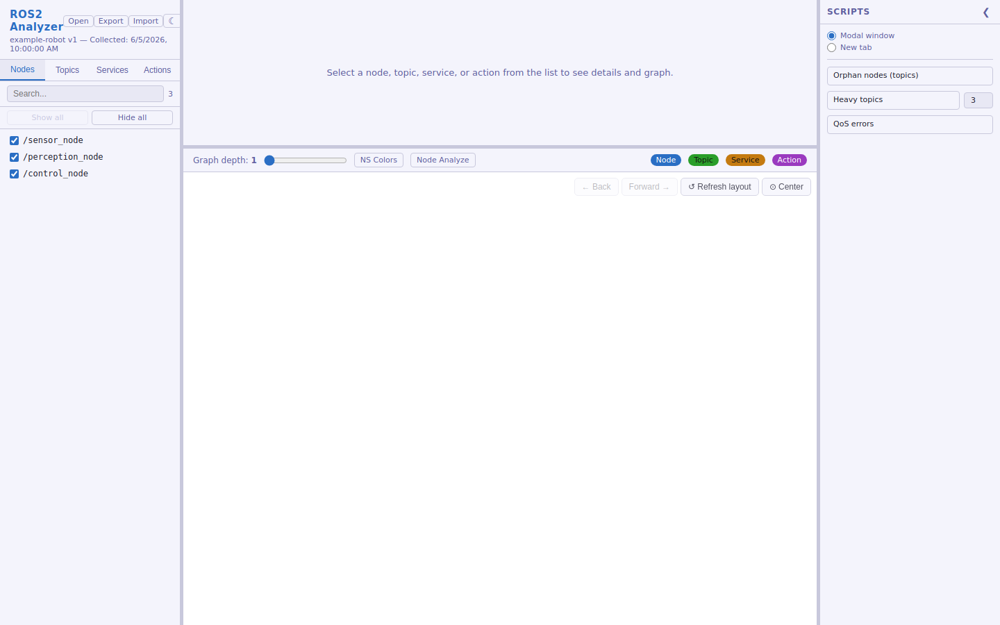
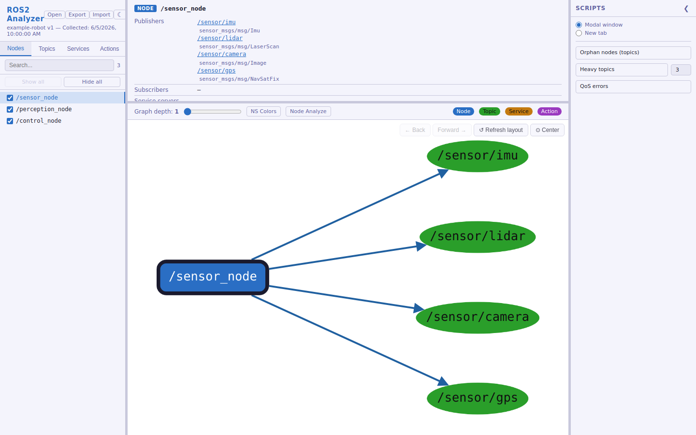
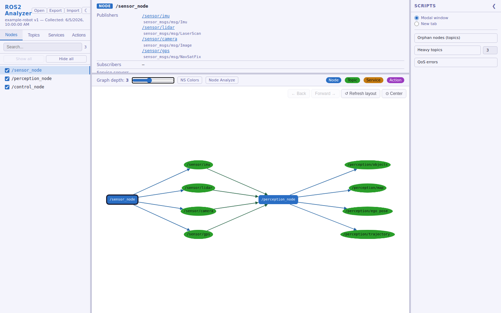
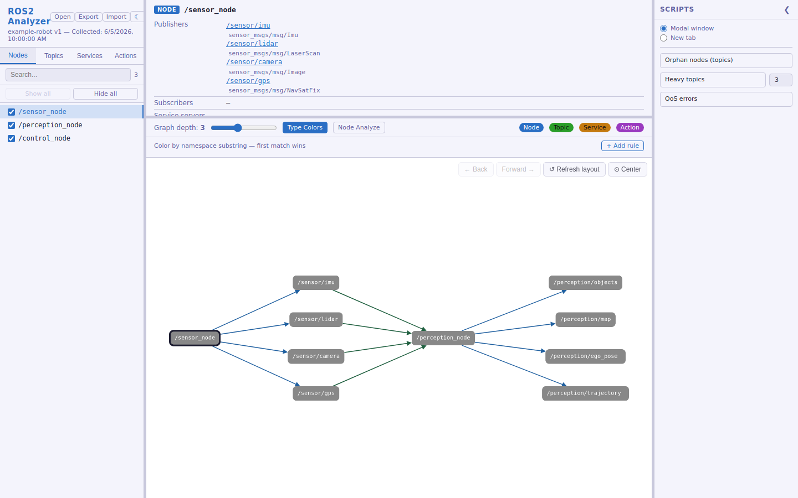
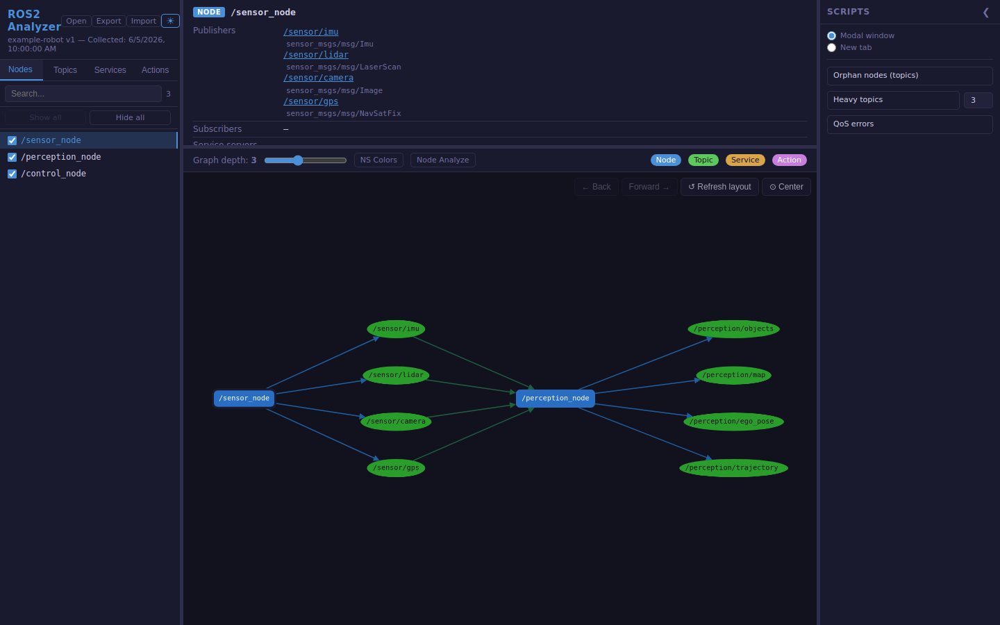

# Инструкция по использованию ROS2 Analyzer

Пошаговое руководство по сбору данных о ROS2-окружении и работе с веб-интерфейсом.
Все скриншоты сделаны на примере файла `ros2_env_example.json` из корня репозитория.

## 1. Открытие файла

Откройте `src/index.html` в браузере. Пока данные не загружены, на экране —
диалог выбора файла: нажмите **Choose file…** или перетащите `.json`-снапшот
прямо на страницу.

## 2. Список сущностей

После загрузки в левой панели появляется список нод — вкладками переключаетесь
между **Nodes / Topics / Services / Actions**, сверху есть поиск по имени.

## 3. Детали и граф связей

Клик по любой сущности в списке открывает панель деталей (тип, QoS, связи) и
строит граф связей на основе BFS-обхода от выбранной сущности.

## 4. Глубина графа

Слайдер **Graph depth** (1–6) управляет тем, сколько «хопов» связей
показывать: depth=1 — только прямые связи, depth=2 и больше — связи связей.

## 5. Цветовой режим по namespace

Кнопка **NS Colors** переключает раскраску узлов графа: по типу сущности или
по настраиваемым правилам — подстрокам namespace (правила добавляются в
панели, которая появляется под графом).

## 6. Тёмная тема

Кнопка ☾/☀ в шапке сайдбара переключает светлую/тёмную тему интерфейса.

## Дополнительно

- **Правая кнопка мыши** на узле графа — скрыть/показать сущность или перейти
  к ней в сайдбаре.
- **Show all / Hide all** — быстро показать или скрыть все сущности текущей
  вкладки в графе.
- **Export / Import** в шапке — сохранить или восстановить настройки
  видимости и правил раскраски как JSON-файл.
- Формат входного JSON-файла и опции коллектора описаны в
  [README.md](../README.md).
